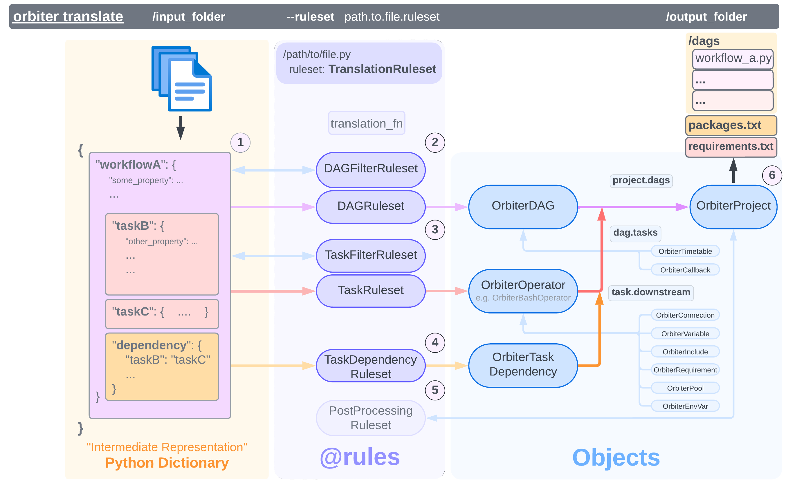

# Overview

**Objects** are returned from [Rules](../Rules_and_Rulesets) during a translation, and
are **rendered** to produce an Apache Airflow Project

An [`OrbiterProject`][orbiter.objects.project.OrbiterProject] holds everything necessary to render an Airflow Project.
This is generated by a [`TranslationRuleset.translate_fn`][orbiter.rules.rulesets.TranslationRuleset].

Workflows are represented by a
[`OrbiterDAG`][orbiter.objects.dag.OrbiterDAG]
which is a Directed Acyclic Graph (of [Tasks](./tasks)).

[`OrbiterOperators`][orbiter.objects.task.OrbiterOperator] represent Airflow Tasks, which
are units of work. An Operator is a pre-defined task with specific functionality.

::: orbiter.objects.OrbiterBase
